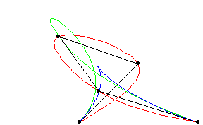

# Curvas e Superfícies - WIP

Aluno: João Vítor Fernandes Dias
Professor: Luis Antonio Rivera Escriba

## Modelagem de Curvas

- Conjunto de pontos
  - Utiliza área de armazenamento
  - Segmentos de retas entre pontos
- Curva aproximada...
- Curva analítica
  - Utiliza de 1 ou mais equações
  - Exata e compacta
  - Não usa área de armazenamento
  - Facilita cálculo de novos pontos
  - fácil transformação geométrica
- y = 3x3 + 2x2 - 4x + 1
  - Paramétricas e no paramétricas
- f(t) = (2t3+t2-4, 3t3-2t-3)

## Curvas em Objetos

- Representação
simplificada de objetos
  - Contornos
- Bezier: Projectos Renault
  - Definição de malhas
  - Características internas
- Contornos de sombras
- Arrugas, etc.
- Formas de objetos
  - Letras
  - Objetos irregulares

## Curvas e Superfícies Paramétricas

- Comum usar CURVA PARAMÉTRICA
  - Fácil desenho da curva/superfície
(aproximada)
  - Fácil segmentar
- Segmento a ser usado
  - Manipulação algébrica mais simples
- Curva em 3D
  - C(t) = [Cx(t) Cy(t) Cz(t)]T
- Superfície em 3D
  - S(u, v) = [Sx(u, v) Sy(u, v) Sz(u, v)]T

Não-paramétrica:

- Explícita: F (x) = y
  - y2 = 4 - x2
- Implícita: F(x,y) = 0
  - y2 + x2 – 4 = 0

Paramétrica:
F(t) = (fx(t), fy(t))
fx(t) = 2cos(t)
fy(t) = 2sen(t)

## Características

Continuidade e Suavidade

- Curvas e Superfícies “suaves”
  - Continuidade: C0 → sen “saltos”
  - Continuidade: C1 → tangentes

variam suavemente

- Continuidade: Ck → k-ésimas

derivadas contínuas
C0

- Alternativamente, Gk : continuidade geométrica
  - Independente de parametrização
  - Assumir curva parametrizada por comprimento de arco

C1
C2

## Interpolação x Aproximação

- Curva suave passando por um conjunto de pontos dados (pontos de controle)
  - Se polinomial, pode-se usar interpolação polinomial Lagrangeana
- Curva suave passando “perto” dos pontos dados
(aproximações)
  - Splines

## Curvas de Hermite

- Curva definida por:
  - P1 y P2 = Pontos extremos (inicial e final)
  - T1 y T2 = Tangentes associadas aos pontos extremos

<!-- Cálculos -->

(dedução)
Seja P(t) = [ x(t), y(t), z(t) ] um ponto da curva
➔ [ x(t) y(t) z(t) ] = [t3 t2 t 1] C = [ t3 t2 t 1 ] [ a b c d ]T
= t3 t2
Condições:

<!-- Cálculos -->

## Curva de Bezier

- Usa K pontos de controle
  - P0, P1, …, Pk-1
  - Curva cúbica usa P0, P1, P2,
P3 (por segmento)
  - Relacionado com Hermite

- Tangentes nos extremos
- T 1 = P1 – P 0 y T 2 = P 3 P2
- Definida por

<!-- Cálculos -->

Pol. de Berstein

## Polinômios de Bernstein

Polinômios de Berstein de grau 3

## Curvas Bézier

(Propriedades)

- Continuidade C0: p3 = p0
- Continuidade C1: C0 e p2p3 de primeiro = p0p1 do segundo
- Continuidade C2: C1 e + restrições sobre p1 da primeira e p2 da segunda
- Fechado Convexo

## Base Bézier

(Forma matricial)

- Um segmento de curva cúbica, para 0 ≤ t ≤ 1

<!-- Cálculos -->

## Splines

- A base de Bézier não é apropriada para modelagem
de curvas longas
  - Bézier única: suporte não local
  - Trechos conectados: restrições não são naturais
- Base alternativa: B-Splines
  - Polígonos de controle sem restrições adicionais
  - Suporte local
- Alteração de um vértice afeta apenas na vecindade
  - Existem muitos tipos de Splines
- Una B-spline uniforme de grau d tem continuidade Cd-1

## Curvas B-Splines

- Combinação linear de:
  - Pontos de controle P0, P1, …, Pn
  - Funções bases de ordem k

Onde Cox de Boor

<!-- Cálculos -->

- Curva não passa pelos pontos de controle

## Curvas B-Spline

- Função base B-spline quadrática periódica

<!-- Gráficos -->

- Função base B-spline cúbica periódica

<!-- Equações -->

## Recorrência Cox-de Boor

<!-- Equações imagens -->

## Propriedades das B-Splines

- Dados n+1 pontos (p0 ... pn) , é composta de (n-d+1) curvas Bézier de grau d unidas com continuidade d-1 nos n+d+1 nós t0 , t1 , ... , tn+d+1
- Cada ponto da curva é afetado por d+1 pontos de controle
- Cada ponto de controle afeta d+1 segmentos
- Curva restrita ao fecho convexo do polígono de controle

Forma Matricial

## Efeito dos Nodos

- Os intervalos entre nodos influencían a
importância dos pontos de controle
  - Exemplo: B-spline Quádrica

## Catmull-Rom Spline

- Interpolação local de BSplines
superfícies- A curva passa por pontos de controle
- Um ponto é calculado em função dos pontos de
controle adjacentes

<!-- Cálculos -->

## Superfícies

<!-- Imagens -->

### Representação de superfícies (superfícies de revolução)

- Rotação de uma curva plana em torno de um eixo
- Ponto da superficie de revolução descrito por
  - P(t, ang)
- Podem ser obtidas por qualquer tipo de curva

### Representação de superfícies (superfícies de deslocamento)

- Denominada “sweeping” (barredura)
- Movimento de uma curva ou figura plana ao longo de um caminho
- Podem ser obtenidas por qualquer tipo de curva

<!-- Imagens -->

### Representação de superfícies (interpolação Bi-cúbica)

- São formas paramétricas
- Qualquer ponto do interior é definido
univocamente
- Cada pedaço (patch) gerada por uma
fórmula

### superfícies Paramétricas

Superficie produto tensor: polinomial bivariante expressado em termos de funções bases univariante.

Representação matricial

Em função de bases bivariantes

Notação matricial

<!-- Imagens -->

Um Patch (16 pontos de controle)

Patches adjacentes

## superfícies de Hermite

- Extesão da formulação de Hermite
- Interior gerada pelas funções combinadas (blending function)
P(u,v) = S H GH HT TT
onde S = [u3, u2, u, 1], T = [v3, v2, v, 1], H matriz de Hermite (matriz das curvas) e GH

<!-- Matriz -->

## superfícies Bézier

- Extensão das curvas de Bezier

onde Bi,j é matriz de vértices de controle, Bi,n(u) e Bj,m(v) são funções de Berstein

<!-- Matrizes -->

## superfícies B-Spline

- Extensão das curvas B-Spline

$$
  P = \begin{bmatrix}
    P_{1, 1} && P_{1, 2} && P_{1, 3} && P_{1, 4} \\
    P_{2, 1} && P_{2, 2} && P_{2, 3} && P_{2, 4} \\
    P_{3, 1} && P_{3, 2} && P_{3, 3} && P_{3, 4} \\
    P_{4, 1} && P_{4, 2} && P_{4, 3} && P_{4, 4}
  \end{bmatrix}
$$

## superfícies Catmull-Rom Spline

<!-- Matrizes -->

## Geração de pontos de controle

- Gerado

<!-- Imagens -->