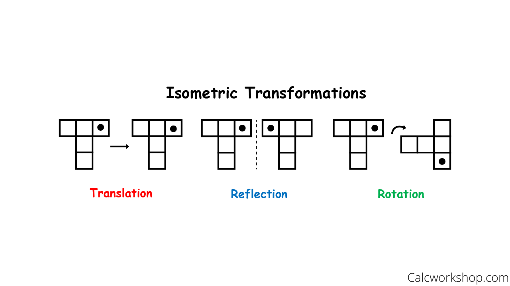

# Transformações Geométricas <!-- 6h53+ -->

Aluno: João Vítor Fernandes Dias
Professor: Luis Antonio Rivera Escriba

## Um Exemplo de OpenGL <!-- Fazer um outro exemplo -->

Abaixo está representado um código em C++

```c++
  #include <GL/glut.h>
  #include <GL/gl.h>
  #include <iostream>
  using namespace std;

  void drawPoint(int x, int y){
    x = x - 250;
    y = 250-y;
    glClear(GL_COLOR_BUFFER_BIT);
    glColor3v(vcor);
    glPointSize(10);
    glBegin(GL_POINTS);
    glVertex2f(x , y);
    glEnd();
    glFlush();
  }

  void mouse(int bin, int state , int x , int y){
    if(bin == GLUT_LEFT_BUTTON &amp;&amp;
    state == GLUT_DOWN) drawPoint(x,y);
  }

  void display(void){}

  void init(void){
    glClearColor (1.0, 1.0, 0.0, 0.0);
    glMatrixMode(GL_MODELVIEW);
    glLoadIdentity();
    glFlush();
  }

  int main(int argc,char** argv){
    glutInit(&amp;argc,argv);
    glutInitDisplayMode(GLUT_SINGLE |
    GLUT_RGB);
    glutInitWindowSize(500,500);
    glutInitWindowPosition(0,0);
    glutCreateWindow("My Window");
    glutMouseFunc(mouse);
    glutMotionFunc(drawSquare);
    glutDisplayFunc(display);
    init();
    glutMainLoop();
    return 0;
  }
```

## Transformações geométricas <!-- 2h08 -->

As transformações geométricas são operações matemáticas realizadas em figuras geométricas com o objetivo de manipular a sua posição. Existem diversos tipos de transformações, algumas das quais, serão ilustradas a seguir.

### Translação

O processo de translação consiste em somar valores a um ponto, assim movendo-o ao longo do plano.


Este mesmo processo pode ser realizado em figuras geométricas, ao realizar a mesma operação a todos os pontos envolvidos.


### Rotação

A rotação consiste em modificar radialmente, em uma determinada quantidade de ângulos, a posição de cada um dos pontos da figura.


### Escala

A escala é realizada ao multiplicar o valor de cada um dos pontos por um mesmo valor, assim resultando em uma figura maior caso o valor seja maior que um ou uma figura menor caso o valor seja entre 0 e 1.


### Reflexão

A reflexão pode ocorrer de várias maneiras diferentes. Seja ela com base nos eixos cartesianos:


Este caso acima se dá ao multiplicar o valor de X de todos os pontos da figura C por -1.

Já no caso abaixo, primeiro é feita essa operação descrita acima, e logo a seguir os valores multiplicados por -1 são os do eixo Y.


A reflexão também pode ocorrer através de um eixo definido arbitrariamente:


### Cisalha (skew/shear)

A cisalha ocorre, por exemplo, ao termos como resultado do eixo Y a soma de seu valor inicial com o valor do eixo X multiplicado por uma constante:

${Axis}_1' = {Axis}_1 + {Axis}_2*k$


## Sistemas de Coordenadas <!-- 1h16min -->

Os sistemas de coordenadas é utilizado para definir com precisão a localização de um objeto dentro de um espaço N-dimensional. Dois casos usuais de sistemas de coordenadas são as **coordenadas cartesianas** que, para representar um ponto em um espaço 2D, usam dois valores representando seu afastamento do centro do plano; e também as **coordenadas polares** que representam um ponto também através de dois valores, sendo o primeiro deles o tamanho do raio de um círculo imaginário centralizado no centro do plano e o ângulo em que esta linha imaginária se encontra, assim resultando na posição deste ponto.

Em ambos os casos conseguimos definir um sistema para especificar a localização de um ponto. Mas isto é apenas parte do problema, visto que não trabalha-se apenas com pontos, mas sim objetos inteiros, assim adentramos na zona dos *sistemas de referência*

### Sistema de Referência

Consideremos o seguinte exemplo:


Neste caso temos uma **ilustração colorida do DVD em movimento** dentro de **uma imagem preta** contida na **tela de seu dispositivo**. Cada um desses escopos apresentam um universo de refência diferente.

#### Objeto <!-- Adicionar uma imagem de um objeto centralizado no (0, 0) -->

No *sistema de referência do objeto* temos o centróide da figura na origem de um plano cartesiano próprio que se mantém independente de qual movimentação o objeto sofrer.

#### Universo <!-- Adicionar uma imagem de um plano cartesiano com o objeto em algum lugar aleatório -->

No *sistema de referência do universo* temos um sistema cartesiano que rege toda a imagem que está sendo calculada. Nele os objetos serão dispostos. Em computação gráfica, é geralmente utilizado um único quadrante que tem sua origem no canto superior esquerdo e que varia de 0 à largura em pixels da imagem e de 0 à altura em pixels da imagem.

#### Normalizado <!-- Não entendi bem como funciona o sistema de referência normalizado -->

<!-- Dúvida: tem como realizar transformações simultaneamente em relação ao sistema de referência do objeto e do universo? Exemplo: uma imagem já transladada no universo, rotacionar ela no sistema objeto e também no universo -->

O *sistema de referência normalizado* se refere à ideia da imagem estar distribuída em um espaço que varie de 0 a 1, assim facilitando os cálculos necessários para as transformações

#### Dispositivo

O *sistema de referência do dispositivo* acaba por ser o sistema mais externo, pois ele definirá os limites físicos para a representação dos objetos dispostos no universo. É nele que também é informado em qual posição da tela do dispositivo que o sistema universo será posicionado.

## Transformações Lineares Bidimensionais <!-- 1h26+ -->

<!-- 40min -->

As transformações lineares bidimensionais ocorrem através de cálculos matriciais sobre os pontos que compõem a figura. Embora estas transformações possam ocorrer em um espaço N-dimensional, aqui trabalharemos apenas no espaço bidimensional.

### Estrutura da multiplicação matricial

$
  T * P_2 = R
$

Onde:

- $T$ é a matriz que contém os valores referentes à transformação a ser efetivada
- $P_2$ é a matriz das coordenadas de um ponto genérico a ser transformado especificamente em 2 dimensões.
- $R$ é a matriz resultante da operação

$
  T = \begin{bmatrix}
  T_{1,1} &
  T_{1,2} \\
  T_{2,1} &
  T_{2,2}
  \end{bmatrix}
$

$
  P_2 = \begin{bmatrix}
  X \\
  Y
  \end{bmatrix}
$

$
  R = \begin{bmatrix}
    T_{1,1}*X + T_{1,2}*Y \\
    T_{2,1}*X + T_{2,2}*Y
  \end{bmatrix}
$

Entretanto, em alguns casos, é necessário utilizar de artifícios matemáticos para calcular de forma adequada as operações bidimensionais. Esses artifícios envolvem utilizar de uma matriz com uma dimensão acima daquela que aparentemente estaríamos calculando, porém apenas adicionando o valor 1 à diagonal principal da nova linha e coluna. Algo similar ocorrendo para os pontos a serem calculados, adicionando a eles uma linha a mais de valor 1.

$
  T * P_3 = R
$

Neste caso, tendo $P_3$ como um ponto genérico representando a segunda dimensão "expandida" à terceira dimensão.

$
  T = \begin{bmatrix}
  T_{1,1} &
  T_{1,2} &
  0 \\
  T_{2,1} &
  T_{2,2} &
  0 \\
  0 &
  0 &
  1
  \end{bmatrix}
$

$
  P_3 = \begin{bmatrix}
  X \\
  Y \\
  1
  \end{bmatrix}
$

$
  R = \begin{bmatrix}
    T_{1,1}*X + T_{1,2}*Y + 0*1 \\
    T_{2,1}*X + T_{2,2}*Y + 0*1 \\
    0*0 + 0*0 + 1*1
  \end{bmatrix} =  \begin{bmatrix}
    T_{1,1}*X + T_{1,2}*Y \\
    T_{2,1}*X + T_{2,2}*Y \\
    1
  \end{bmatrix}
$

<!-- Adicionar a matriz N-dimensional em LaTeX -->

### Translação Matricial <!-- 6min+ -->

Já vimos anteriormente de que forma a translação funciona, mas agora precisamos estruturá-la de forma matricial da seguinte forma:

$
  TM = \begin{bmatrix}
  1 && 0 && T_x \\
  0 && 1 && T_y \\
  0 && 0 && 1
  \end{bmatrix}
$

$TM$: Translação Matricial

$
  RTM = TM*P_3 = \begin{bmatrix}
  X + T_x \\
  Y + T_y \\
  1
  \end{bmatrix}
$

$RTM$: Resultado da Translação Matricial.
Temos nesse caso que $T_x$ é o valor da tranlação no eixo X e $T_y$ é o valor da translação no eixo Y.

### Rotação Matricial <!-- 60min -->

A rotação matricial envolve a manipulação dos pontos de acordo com um determinado ângulo que aqui será representado como $\theta$.

$
  RM = \begin{bmatrix}
    \cos(\theta) && - \sin(\theta) \\
    \sin(\theta) && \cos(\theta)
  \end{bmatrix}
$

Entretanto, realizar a operação de rotação em uma figura, fará com que ela translade.


Para isto, é necessário primeiro transladá-la em direção à origem, efetuar a rotação, e então realizar a tranlação inversa de volta ao local de onde ela saiu originalmente


#### Euler

A rotação de Euler apresenta uma forma de rotacionar um conjunto de pontos segundo um eixo específico. Para isso ele utiliza da ideia da rotação já apresentada na matriz anterior. Entretanto, para gerar a rotação segundo um eixo em específico, o que ele faz é adicionar uma nova linha e coluna contendo o valor 1 apenas na diagonal principal no "índice do grau da dimensão", ou seja, para rotacionar ao redor do eixo X, uma nova linha na posição 1 e uma nova coluna também na posição 1.


##### Rotacionar em X (Roll - Rolagem)

$
  ER_X = \begin{bmatrix}
    1 && 0 && 0 \\
    0 && \cos(\phi) && - \sin(\phi) \\
    0 && \sin(\phi) && \cos(\phi)
  \end{bmatrix}
$

##### Rotacionar em Y (Pitch - Arfagem)

$
  ER_Y = \begin{bmatrix}
    \cos(\theta) && 0 && \sin(\theta) \\
    0 && 1 && 0 \\
    - \sin(\theta) && 0 && \cos(\theta)
  \end{bmatrix}
$

##### Rotacionar em Z (Yaw - Guinada)

$
  ER_Z = \begin{bmatrix}
    \cos(\psi) && - \sin(\psi) && 0 \\
    \sin(\psi) && \cos(\psi) && 0 \\
    0 && 0 && 1
  \end{bmatrix}
$


### Escala Matricial

Como já comentado, a escala funciona ao multiplicar os eixos X e Y por escalares. Esses escalares podem ser iguais ou diferentes para cada um dos eixos. Entretanto, apenas realizar esta operação pode gerar resultados inesperados.


Para lidar com isso, assim como na rotação, é necessário primeiro transladar a imagem ao centro, para só então realizar a escala e depois a retornar ao seu local de origem com a translação inversa.


A operação pode ser realizada utilizando a matriz quadrada de grau 2.

$EM_2$: Escala Matricial 2D
$
  EM_2 = \begin{bmatrix}
    S_x && 0 \\
    0 && S_y
  \end{bmatrix}
$

Entretanto, por padronização, considerando os pontos 2D "expandidos", devemos também utilizar a matriz 2d "expandida".

$EM_{2^+}$: Escala Matricial 2D expandida
$
  EM_{2^+} = \begin{bmatrix}
    S_x && 0    && 0 \\
    0   && S_y  && 0 \\
    0   && 0    && 1
  \end{bmatrix}
$

### Reflexão Matricial

A reflexão matricial se refere a multiplicar os pontos por um valor negativo de acordo com o eixo em que deseja-se refletir. Se deseja refletir em relação ao eixo X, a primeira linha deve ser negativa; se for em relação a y, a segunda linha que deve estar negativa. Se o valor negativo não for 1, além de haver a reflexão, haverá também a escala.

$RefMat_x$: Reflexão em relação a X

$
  RefMat_x = \begin{bmatrix}
  -1 && 0 && 0 \\
  0 && 1 && 0 \\
  0 && 0 && 1
  \end{bmatrix}
$

$RefMat_y$: Reflexão em relação a Y

$
  RefMat_y = \begin{bmatrix}
  1 && 0 && 0 \\
  0 && -1 && 0 \\
  0 && 0 && 1
  \end{bmatrix}
$

$RefMat_{xy}$: Reflexão em relação a X e Y

$
  RefMat_{xy} = \begin{bmatrix}
  -1 && 0 && 0 \\
  0 && -1 && 0 \\
  0 && 0 && 1
  \end{bmatrix}
$


### Cisalhamento (Shearing ou Skew) <!-- 20min -->

A cisalha ocorre ao permitir a distorção da figura em um dos eixos ao multiplicá-lo por uma constante.


$C_x^+$: Distorção em X.
$
  C_x^+ = \begin{bmatrix}
  1 && k && 0 \\
  0 && 1 && 0 \\
  0 && 0 && 1
  \end{bmatrix}
$

$C_y^+$: Distorção em Y.
$
  C_y = \begin{bmatrix}
  1 && 0 && 0 \\
  k && 1 && 0 \\
  0 && 0 && 1
  \end{bmatrix}
$


## Transformações Rígidas <!-- + -->

As transformações rígidas são aquelas que não modificam os ângulos e dimensões. São elas: *translação*, *rotação* e *reflexão*.

Estes detém matrizes ortonormais, ou seja, cada um de seus vetores são ortogonais entre si (o produto escalar entre qualquer par de linhas é 0) e é unitário (têm comprimento 1). Além disso, sua matriz inversa é também sua matriz transposta.

### Isometrias do Plano

Estas transformações apresentam também isometria no espaço euclidiano, visto que mantém a mesma distância entre os pontos após serem feitas as transformações.



## Composição de Transformações <!-- 38 min -->

Normalmente, não serão utilizadas apenas uma das transformações a um determinado objeto. Muito pelo contrário. Geralmente as transformações são feitas em conjuntos, seja rotacionando e espelhando, ou então transladando e escalando.

Geralmente estes conjuntos de transformações estão "encapsuladas" em um pacotinho que começa com a translação do objeto para a origem, seguido do conjunto de operações que se deseja fazer: rotações, cisalhas, escalas ou outras; em seguida, ocorrendo a translação inversa, ou seja, realizando o movimento contrário que o colocou no centro.

Estes conjuntos de operações podem até mesmo ser convertidos em uma única matriz de transformação, como por exemplo:

Considere que queremos primeiro escalar o objeto no eixo y, em seguida efetuar uma cisalha no eixo x e então uma reflexão nos eixos x e y. Podemos então considerar o seguinte conjunto de ações:
$P_r = P*[T*(E_y*C_x*R_{xy})*T^{-1}] = P*[T*TL_r*T^{-1}]$, onde temos as matrizes representando:

- $P_r$: Ponto resultante após operações
- $P$: Ponto inicial
- $T$: Translação ao centro
- $E_y$: Escala
- $C_x$: Cisalha
- $R_{xy}$: Reflexão
- $T^{-1}$: Translação inversa
- $TL_r$: Transformação Linear Resultante

$
  E_y = \begin{bmatrix}
    1   && 0    && 0 \\
    0   && S_y  && 0 \\
    0   && 0    && 1
  \end{bmatrix}
$

$
  C_x = \begin{bmatrix}
  1 && k && 0 \\
  0 && 1 && 0 \\
  0 && 0 && 1
  \end{bmatrix}
$

$
  R_{xy} = \begin{bmatrix}
  -1 && 0 && 0 \\
  0 && -1 && 0 \\
  0 && 0 && 1
  \end{bmatrix}
$

$TL_r = E_y*C_x*R_{xy} $

$
  TL_r = \begin{bmatrix}
  -1 && k && 0 \\
  0 && -S_y && 0 \\
  0 && 0 && 1
  \end{bmatrix}
$

## Trabalho bonus <!-- 7 min - é isso mesmo? -->

<details> <summary>

Código em c++

</summary>

basicGlMouseManipula-Verao2023.cpp

```c++
#include <string.h>
#include <stdlib.h>
#include <stdio.h>
#include <math.h>
#include "GL/glut.h"

#define MAXVERTEXS 30
#define PHI 3.141572
GLenum doubleBuffer;

typedef struct spts
{
    float v[3];
} tipoPto;

// tipoPto ppuntos[MAXVERTEXS];

tipoPto pvertex[MAXVERTEXS]; // vetor de MAXVERTEXS de v[3] como espaço máximo

int windW, windH;    // medidas das dimensoes da janela Canvas: W largura  H: altura
int tipoPoligono;    // poligono prenchido, contorno ou pontos nos vértices
int gNumVert = 0;    // nnumero de pontos ou vértices do poligono criado
int jaPoligono = 0;  // modo de representacao--> 0: pontos;  1: polígono
float gMatriz[3][3]; // matriz de transformacao
int gIndVert = -1;   // indice do vértice selecionado
int gTransform = 0;  // transformacao: 0: nula; 1: Translacao; 2: Rotacao; 3: Escala; 4: Espelha; 5: Cisalha
float gCen[3];       // centroido do poligono
float gAng = 0.0f;   // angulo para rotacao

void init(void)
{

    int i;
    jaPoligono = 0;
    gNumVert = 0; // zero pontos
    tipoPoligono = GL_POINTS;
    gTransform = 0; // transforma Nula
    gIndVert = -1;  // indice do vértice selecioado nulo
    // inicializa com ZERO o vetor pvertex
    for (i = 0; i < MAXVERTEXS; i++)
    {
        pvertex[i].v[0] = 0.0f;
        pvertex[i].v[1] = 0.0f;
        pvertex[i].v[2] = 1.0f;
    }
    // calcula o angulo básico de rotacao
    gAng = (2.0f * PHI) / 360.0f;
}

void matrizIdentidade(void)
{
    gMatriz[0][0] = 1.0f;
    gMatriz[0][1] = 0.0f;
    gMatriz[0][2] = 0.0f;
    gMatriz[1][0] = 0.0f;
    gMatriz[1][1] = 1.0f;
    gMatriz[1][2] = 0.0f;
    gMatriz[2][0] = 0.0f;
    gMatriz[2][1] = 0.0f;
    gMatriz[2][2] = 1.0f;
}

static void Reshape(int width, int height)
{
    windW = width / 2;
    windH = height / 2;

    glViewport(0, 0, width, height);
    glMatrixMode(GL_PROJECTION);
    glLoadIdentity();
    gluOrtho2D(-windW, windW, -windH, windH);
    glMatrixMode(GL_MODELVIEW);
}

static void Key(unsigned char key, int x, int y)
{
    switch (key)
    {
    case 27:
        exit(0);
    }
}

void coord_line(void)
{
    glLineWidth(1);
    glColor3f(1.0, 0.0, 0.0);
    // vertical line
    glBegin(GL_LINE_STRIP);
    glVertex2f(-windW, 0);
    glVertex2f(windW, 0);
    glEnd();
    glColor3f(0.0, 1.0, 0.0);
    // horizontal line
    glBegin(GL_LINE_STRIP);
    glVertex2f(0, -windH);
    glVertex2f(0, windH);
    glEnd();
}

void PolygonDraw(void)
{
    int i;
    glColor3f(0.0, 0.0, 0.0);
    glPolygonMode(GL_FRONT_AND_BACK, tipoPoligono);
    glBegin(tipoPoligono);
    for (i = 0; i < gNumVert; i++)
    {
        glVertex2fv(pvertex[i].v);
    }
    glEnd();
}

static void Draw(void)
{
    glClearColor(1.0, 1.0, 1.0, 0.0);
    glClear(GL_COLOR_BUFFER_BIT);
    coord_line();
    PolygonDraw();
    if (doubleBuffer)
    {
        glutSwapBuffers();
    }
    else
    {
        glFlush();
    }
}

void calCentro(float cc[])
{
    int i;
    // computando o centroide
    cc[0] = cc[1] = cc[2] = 0.0f;
    for (i = 0; i < gNumVert; i++)
    {
        cc[0] += pvertex[i].v[0];
        cc[1] += pvertex[i].v[1];
        cc[2] += pvertex[i].v[2];
    }
    cc[0] /= gNumVert;
    cc[1] /= gNumVert;
    cc[2] /= gNumVert;
}

//  Vetor = Matriz x Vetor
// ----------------------------
void operaTransforma(float v[])
{
    float temp[3];
    int i, j;
    // temp = Matriz x vetor
    for (i = 0; i < 3; i++)
    {
        temp[i] = 0.0f;
        for (j = 0; j < 3; j++)
            temp[i] = temp[i] + gMatriz[i][j] * v[j];
    }
    // copia vetor resultando no vetor original
    for (i = 0; i < 3; i++)
        v[i] = temp[i];
}

void translate(float dx, float dy)
{
    int i;
    matrizIdentidade(); // gera a matriz de identidade gMatriz
    // preenche matriz translacao:  [ 1  0  dx |  0  1  dy |  0  0  1 ]
    gMatriz[0][2] = dx;
    gMatriz[1][2] = dy;
    // opera transformação de cada vetor vértice
    for (i = 0; i < gNumVert; i++)
        operaTransforma(pvertex[i].v);
}

//----- Rotacao de um poligono -- cada vértice é um vetor ------------------------------------------------
//      Calcular vetor de traslacao (vetor do origem ao centro do poligono) --> VC
//      Transladar o polígono ao origem do sistema   --->  MatrizTraslacao(VC). Poligono => PoligonoT
//      Definir a matriz de Rotacao --> MatrizRotacao(teta)
//      Rotacionar o poligono   ---> MatrizRotacao(teta).Poligono ==> PoligonoTR
//      Trasladar para origem original --> MatrizTranslacao(-VC).PoligonoTR ==> PoligonoTRT' = PoligonoR
// ---------------------------------------------------------------------------------------------------------
void rotate(float dx, float dy)
{
    int i;
    float oo, teta, vc[3];

    // calculo do angulo
    // ----------------------------------------------
    // seja vetor do centro para o vertice: vv
    // dd = (dx, dy) é o vetor deslocalmento do mouse
    // oo = vv x dd  (produto vetorial)
    // se oo positivo ==> rota antihorario;
    // se oo negativo ==> rota horario
    // ----------------------------------------------

    calCentro(vc);                     // calculo vetor vc ao centro geométric do polígono
    translate(-1 * vc[0], -1 * vc[1]); // translada o polígo ao origem em -vc
    // determinando o angulo:
    // produto vetorial --> (v[0], v[1]) x (dx, dy)
    oo = pvertex[gIndVert].v[1] * dx - pvertex[gIndVert].v[0] * dy;
    // oo é esacalar positivo (horaria) ou negativo (anti-horaria)
    teta = gAng; // angulo constante definido no init
    if (oo > 0.0f)
        teta = -1.0f * gAng;
    // Define a matriz de Rotacao
    matrizIdentidade();
    gMatriz[0][0] = cos(teta);
    gMatriz[0][1] = -sin(teta);
    gMatriz[1][0] = sin(teta);
    gMatriz[1][1] = cos(teta);

    // opera transformação Rotacao de cada vetor vértice
    for (i = 0; i < gNumVert; i++)
        operaTransforma(pvertex[i].v);
    translate(vc[0], vc[1]); // o poligo é tranladado para sua posicao original
}

// -------- verifica se um ponto (x, y) posia se considerar um vértice do polígono
// ---------------------------------------------------------------------------------
int clipVertex(int x, int y)
{
    int i;
    float d;
    gIndVert = -1;
    // para cada vértice do poligono
    for (i = 0; i < gNumVert; i++)
    {
        // distancia do ponto (x, y) a cada vértice do poligono
        d = sqrt(pow((pvertex[i].v[0] - x), 2.0) + pow((pvertex[i].v[1] - y), 2.0));
        // se a distancia d é bem proxima ( d < 3 pixel)
        if (d < 3.0)
        {
            gIndVert = i; // achou o indice do vértice
            break;
        }
    }
    return gIndVert;
}

// -------- Evento Arrastando o mouse pressionado o botão direito
// -------------- gerando manipulacao direta ---------------------
void motion(int x, int y)
{
    float dx, dy;
    if (gIndVert > -1)
    {
        x = x - windW;
        y = windH - y;
        dx = x - pvertex[gIndVert].v[0];
        dy = y - pvertex[gIndVert].v[1];
        switch (gTransform)
        {
        case 1:
            translate(dx, dy);
            break;
        case 2:
            rotate(dx, dy);
            break;
            //  case 3: scale(dx, dy); break;
            //  case 4: mirror(dx, dy); break;
            //  case 5: shear(dx, dy); break;
        }
        Draw();
    }
}

// -------- Eveto CLICK botão MOUSE ----------
// -------------------------------------------
void mouse(int button, int state, int x, int y)
{
    if (state == GLUT_UP) //  botão SOLTO
    {
        printf("\n jaPoligono %d ", jaPoligono);
        if (button == GLUT_LEFT_BUTTON)
        {
            if (jaPoligono == 0) // ainda não definido o polígono
            {
                x = x - windW;
                y = windH - y;
                glPointSize(3);
                pvertex[gNumVert].v[0] = (float)x;
                pvertex[gNumVert].v[1] = (float)y;
                pvertex[gNumVert].v[2] = 1.0f;
                gNumVert++;
            }
        }
    }
    else // state == GLUT_DOWN  --> Botão pressionado
    {
        if (jaPoligono == 1)
        { // polígono já definido
            if (gTransform)
            { // Uma ransformacao selecionada
                if (button == GLUT_LEFT_BUTTON)
                {
                    x = x - windW;
                    y = windH - y;
                    // clipingVertex
                    gIndVert = clipVertex(x, y); // verificar e identificar um vértice selecionado
                    printf("\n clipVetex: %d ", gIndVert);
                }
            }
        }
    }
    glutPostRedisplay();
}

static void Args(int argc, char **argv)
{
    GLint i;
    doubleBuffer = GL_FALSE;
    for (i = 1; i < argc; i++)
    {
        if (strcmp(argv[i], "-sb") == 0)
        {
            doubleBuffer = GL_FALSE;
        }
        else if (strcmp(argv[i], "-db") == 0)
        {
            doubleBuffer = GL_TRUE;
        }
    }
}

// ------------------------------
// Eventos definidos no MENU
// ------------------------------

// Evento do menu geral
// ---------------------------
void processMenuEvents(int option)
{
    switch (option)
    {
    case 0:
        init();
        break;
    }
    glutPostRedisplay();
}

// Eventos do menu de geracao de poligono
// --------------------------------------
void processSubMenuEventsPolig(int option)
{
    if (option == 0)
        tipoPoligono = GL_POINTS;
    else if (option == 1)
    {
        tipoPoligono = GL_LINE_LOOP;
        jaPoligono = 1;
    }

    glutPostRedisplay();
}

// Eventos do menu de transformadas
// ----------------------------------
void processSubMenuEventsTransf(int option)
{
    if (jaPoligono)
    {
        gTransform = option;
        printf("\n Transforma: %d ", gTransform);
    }

    glutPostRedisplay();
}

// Definição do Menu principal
// ---------------------------
void createGLUTMenus()
{
    int menu, submenu1, submenu2;

    submenu1 = glutCreateMenu(processSubMenuEventsPolig);
    glutAddMenuEntry("Pontos", 0);
    glutAddMenuEntry("Poligono", 1);

    submenu2 = glutCreateMenu(processSubMenuEventsTransf);
    glutAddMenuEntry("Translação", 1);
    glutAddMenuEntry("Rotação", 2);
    glutAddMenuEntry("Escala", 3);
    glutAddMenuEntry("Espelho", 4);
    glutAddMenuEntry("Cisalha", 5);

    menu = glutCreateMenu(processMenuEvents);
    glutAddMenuEntry("Limpar", 0);
    glutAddSubMenu("Tipo Objeto", submenu1);
    glutAddSubMenu("Transformação", submenu2);
    glutAttachMenu(GLUT_RIGHT_BUTTON);
}

int main(int argc, char **argv)
{
    GLenum type;
    glutInit(&argc, argv);
    Args(argc, argv);
    type = GLUT_RGB;
    type |= (doubleBuffer) ? GLUT_DOUBLE : GLUT_SINGLE;
    glutInitDisplayMode(type);
    glutInitWindowSize(600, 500);
    glutCreateWindow("Basic Program Using Glut and Gl");
    init();
    glutReshapeFunc(Reshape);
    glutKeyboardFunc(Key);
    glutDisplayFunc(Draw);
    glutMotionFunc(motion);
    glutMouseFunc(mouse); // CLICK e RELEASE botão de mouse
    //	glutIdleFunc(idle);
    createGLUTMenus();
    glutMainLoop();
    return (0);
}
```

</details>

## Transformadas Homogêneas <!-- 12 min -->

Uma transformação Homogênea ocorre para conseguir padronizar os cálculos a serem feitos sobre determinadas matrizes. Aqui, onde temos utilizado o termo "expandida" para matrizes e pontos, podemos considerar que as transformações homogêneas podem ser utilizadas para manter este "anexo" sempre unitário. Caso este "anexo" tenha um valor diferente de 1, toda a matriz deve ser dividida por seu valor para que o anexo passe a ser unitário.

$
  TH = \begin{bmatrix}
  X \\ Y \\ Z \\ M
  \end{bmatrix} = \begin{bmatrix}
  X \\ Y \\ Z \\ M
  \end{bmatrix} * (1/M) = \begin{bmatrix}
  X/M \\ Y/M \\ Z/M \\ 1
  \end{bmatrix}
$

## Projeções Geométricas <!-- 40 min + 26 min-->

<!-- Chat baseado em texto gerado pelo chat GPT -->

As projeções geométricas são técnicas utilizadas na computação gráfica para representar objetos tridimensionais em uma tela bidimensional. Elas funcionam mapeando os pontos de um objeto tridimensional para uma tela bidimensional de acordo com certas regras matemáticas.

As projeções dependem do *plano de projeção*, *raio de projeção* e *centro de projeção*. O *plano de projeção* faz o papel de uma tela que é onde a visualização 2D do objeto 3D será representada.

Neste exemplo, ocorre a projeção paralela, onde os "raios de luz" são emitidos paralelos entre si e neste caso, perpendiculares a cada um dos planos. Esses raios de luz são os *raios de projeção*, também chamadas de *projetantes*.


Além desses dois, há também o *centro de projeção* que de onde saem os *raios de projeção* que vão em direção ao objeto.

### Classificação

Existem vários tipos diferentes de projeções geométricas. Estes são ilustrados na figura a seguir.


### Classes de Projeções

Como visto, existem diversas classes de projeções, algumas delas são:

- Projeção Paralela Ortográfica: possui o centro de projeção no infinito
- Projeção Paralela Oblíqua: em que os raios de projeção são obliquos ao plano de projeção
- Projeção Paralela Oblíqua Cavaleira: onde uma face do objeto é posta paralela ao quadro.
- Projeção perspectiva: representação do espaço 3D da forma vista por olho humano. Ela pode também conter pontos de fuga que são pontos virtuais para onde retas presentes na imagem parecem convergir.

Cada uma dessas projeções apresentam matrizes que a representam, mas que não serão demonstradas no momento.

### Câmera Virtual

A câmera virtual serve como um ponto de observação por onde um observador estaria analisando algum objeto ou cena. A câmera possui uma posição no espaço (x, y, z), uma orientação (um vetor de direcionamento de sua frente), uma posição do foco <!-- Não entendi -->, e planos de corte (clipping planes) que irão definir quais partes da cena não serão renderizadas.


Nesta imagem vemos a simulação de uma câmera virtual rodeando um cubo. Perceba que a posição da câmera muda constantemente, assim como sua orientação também muda para manter o cubo no centro.
