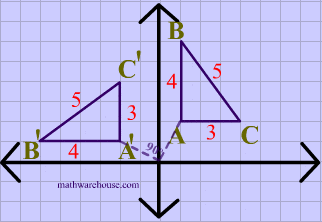

# Transformações Geométricas - TRABALHO EM ANDAMENTO

Aluno: João Vítor Fernandes Dias
Professor: Luis Antonio Rivera Escriba

<!-- TO-DO
  https://www.tutorialspoint.com/computer_graphics/2d_transformation.htm
  Use Matrices
-->

## Um Exemplo de OpenGL <!-- Fazer um outro exemplo -->

Abaixo está representado um código em C++

```c++
  #include <GL/glut.h>
  #include <GL/gl.h>
  #include <iostream>
  using namespace std;

  void drawPoint(int x, int y){
    x = x - 250;
    y = 250-y;
    glClear(GL_COLOR_BUFFER_BIT);
    glColor3v(vcor);
    glPointSize(10);
    glBegin(GL_POINTS);
    glVertex2f(x , y);
    glEnd();
    glFlush();
  }

  void mouse(int bin, int state , int x , int y){
    if(bin == GLUT_LEFT_BUTTON &amp;&amp;
    state == GLUT_DOWN) drawPoint(x,y);
  }

  void display(void){}

  void init(void){
    glClearColor (1.0, 1.0, 0.0, 0.0);
    glMatrixMode(GL_MODELVIEW);
    glLoadIdentity();
    glFlush();
  }

  int main(int argc,char** argv){
    glutInit(&amp;argc,argv);
    glutInitDisplayMode(GLUT_SINGLE |
    GLUT_RGB);
    glutInitWindowSize(500,500);
    glutInitWindowPosition(0,0);
    glutCreateWindow("My Window");
    glutMouseFunc(mouse);
    glutMotionFunc(drawSquare);
    glutDisplayFunc(display);
    init();
    glutMainLoop();
    return 0;
  }
```

## Transformações geométricas <!-- 2h08 -->

As transformações geométricas são operações matemáticas realizadas em figuras geométricas com o objetivo de manipular a sua posição. Existem diversos tipos de transformações, algumas das quais, serão ilustradas a seguir.

<!-- [IMG_Translação_Figura]: Cap2-images/Translação_Figura.gif "Translação de figuras"
[IMG_Translação_Ponto]: Cap2-images/Translação_Ponto.gif "Translação de ponto"
[IMG_Reflexão_Múltipla]: Cap2-images/Reflexão_Múltipla.gif "Reflexão ao redor dos eixos"
[IMG_Reflexão_X0]: Cap2-images/Reflexão_X0.gif "Reflexão em X = 0"
[IMG_Reflexão_YX]: Cap2-images/Reflexão_YX.gif "Reflexão em Y = X"
[IMG_Cisalha]: Cap2-images/Cisalha.gif "Cisalha"
[IMG_Rotação]: Cap2-images/Rotação.gif "Rotação"
[IMG_Escala]: Cap2-images/Escala.gif "Escala" -->

### Translação

O processo de translação consiste em somar valores a um ponto, assim movendo-o ao longo do plano.


Este mesmo processo pode ser realizado em figuras geométricas, ao realizar a mesma operação a todos os pontos envolvidos.


<!-- ![Teste][IMG_Translação_Figura]
![Teste][IMG_Translação_Ponto] -->

### Rotação

A rotação consiste em modificar radialmente, em uma determinada quantidade de ângulos, a posição de cada um dos pontos da figura.



<!-- ![Teste][IMG_Rotação] -->

### Escala

A escala é realizada ao multiplicar o valor de cada um dos pontos por um mesmo valor, assim resultando em uma figura maior caso o valor seja maior que um ou uma figura menor caso o valor seja entre 0 e 1.


<!-- ![Teste][IMG_Escala] -->

### Reflexão

A reflexão pode ocorrer de várias maneiras diferentes. Seja ela com base nos eixos cartesianos:


Este caso acima se dá ao multiplicar o valor de X de todos os pontos da figura C por -1.

Já no caso abaixo, primeiro é feita essa operação descrita acima, e logo a seguir os valores multiplicados por -1 são os do eixo Y.


A reflexão também pode ocorrer através de um eixo definido arbitrariamente:


<!-- ![Teste][IMG_Reflexão_Múltipla] -->
<!-- ![Teste][IMG_Reflexão_X0] -->
<!-- ![Teste][IMG_Reflexão_YX] -->

### Cisalha (skew/shear)

A cisalha ocorre, por exemplo, ao termos como resultado do eixo Y a soma de seu valor inicial com o valor do eixo X multiplicado por uma constante:

${Axis}_1' = {Axis}_1 + {Axis}_2*k$


<!-- ![Teste][IMG_Cisalha] -->

## Sistemas de Coordenadas

Sistema de Referencia do Objeto
Sistema de Referencia do Universo
Sistema de Referencia Normalizado
Sistema de Referencia do Dispositivo

- Transformações entre Sistemas de Coordenadas
  - Escala
  - Rotação
  - Traslação
  - SRO
  - SRU
  - Reflexão
  - SRU

## Transformações Lineares Bidimensionais

- Origem é ponto fixo.
  - Translação não é transformação linear → transf. afim
- Operações de matrizes, para cada ponto (x, y, z) do objeto

### Translação

Transformação Linear??

#### Translação TL?

Transformada Afim

### Rotação

Rotação no eixo: combinação de translação e rotação

Translada (O)

Rotaciona (O)

Translada-1 (O)

#### Euler

Rotando Z

Rotando X

Rotando Y

Ex.: Rotar em (10, 20 ,30)

Ordem de rotação afeta resultado?

### Escala

Operação correta: combinação de traslação e escala

### Reflexão

Reflexão respeito ao plano XZ

Reflexão respeito aos dois ejes ( ex. X e Y )

### Cisalhamento (Shearing ou Skew)

Distorção em X

Distorção em 2 direções

### Transformações Rígidas

- Rotações, Reflexões y Traslações.
  - Preservam ângulos e dimensões.
  - Matrizes Ortonormais.
  - Inversa é a matriz transposta (T-1 = TT).
  - Isometrias do Espaço Euclideano

#### Isometrias do Plano

<!-- imagem -->

#### Composição de Transformações

- Sequência de transformações de um ponto P
arbitrário:
  - T: Translação de P para origem.
  - R, S, E: Rotação, Shear, Escala.
  - Outras transformações desejadas.
  - T-1: Translação inversa.

## Trabalho bonus

- Na sala de aula
  - Dados o programa
    - testeMouse02.c (gera polígono e mouseMotion)

## Transformadas Homogêneas

- Fácil Transformações Shear, Reflexão, Rotação, e
Escala – uma única matriz
  - Translação realizado por separado
    - Não é transformada Linear
- Em 3D,
  - Ponto P = [x, y, z] ➔ P’ = [X, Y, Z, M]
  - P = [x, y, z, 1] = [X/M, Y/M, Z/M, 1]
  - P e P’ são equivalentes se P = (1/M) P’

Rotação
Escala
Traslação

## Projeções Geométricas

- Permitem a visualização 2D de objetos 3D
  - Projeção no plano
  - Raio projeção
  - Centro de projeção
- Plano de projeção: plano de imagem 2D
- Raio de Projeção: raio pasando por P (do objeto) e por um ponto do plano
- Centro de projeção: ponto de convergencia (ex. Origem)

## Efeito

Projeção Perspectiva e pontos de fuga?

## Projeções Geométricas (Classificação)

<!-- Fluxograma -->

### Classes de Projeções

- Projeção Paralela Ortográfica (Centro de projeção no infinito)
- Projeção Paralela Obliqua (Raios de Projeção obliquas ao plano de projeção)
- Projeção Paralela Obliqua Cavaleira

### Projeção Perspectiva

- Representação do espaço 3D: da forma vista por olho humano

#### Plano de projeção em z = f

#### Plano em qualquer plano

#### Dois ou Três Pontos de Projeção = Pontos de Fuga

## Câmera Virtual

- Observador
  - Ponto de observação
    - Posição da cámera: (x, y, z)
    - Orientação (vetor view up)
    - Posição do foco (D em direção C)
    - Clipping planes (direção focal perpendicular)
