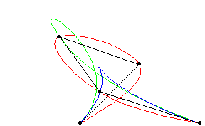

# Curvas e Superfícies

<!--
Comecei: 14/02/23 - 21h02
Finalizei: 15/02/23 - 12h54
Duração: 7:58:29 (Somando com tempos anteriores envolvendo Git Large Files)
-->

Aluno: João Vítor Fernandes Dias
Professor: Luis Antonio Rivera Escriba

Semestre: 2022/E - 2023/01~2023/02

## Modelagem de Curvas

Curvas podem ser armazenadas de duas formas: como um conjunto de pontos ou em sua forma analítica. No primeiro caso, acaba-se gastando muito armazenamento. Ela também acaba lidando com muitas aproximações pois cria pequenas retas entre cada um dos pontos para simular uma curva contínua. No segundo, a curva é armazenada como uma equação ou como um conjunto delas. Tende a ser mais exata, compacta e facilita cálculos.

## Geração de pontos de controle

Boa parte das curvas que veremos daqui em diante são manipuladas através de pontos chamados "pontos de controle". Eles são pontos definidos de acordo com a necessidade, ora manualmente, ora seguindo determinado conjunto de regras. Eles irão reger de que forma comporta cada curva ou superfície.

## Curvas em Objetos

Através de curvas, acaba se tornando mais simples para definir a curvatura dos objetos. A alternativa para isso seria definir cada um dos vértices, definindo manualmente os planos que em conjunto se tornam as malhas.

<!-- Imagem de curvas vs wireframes -->

## Curvas e Superfícies Paramétricas

É comum utilizar as curvas analítica em sua forma paramétria, pois são fáceis de segmentar, desenhar e manipular algebricamente.

<!-- Teste de demora: 21h16 -->
- Curva em 3D

$$
C(t) =
\begin{bmatrix}
C_x(t) && C_y(t) && C_z(t)
\end{bmatrix}
^T
$$

<!-- 21h19 -->

- Superfície em 3D

$$
S(u, v) =
\begin{bmatrix}
S_x(u, v) && S_y(u, v) && S_z(u, v)
\end{bmatrix}
^T
$$
<!-- 21h22 -->
### Exemplos de curvas

- Não paramétricas
  - Explícita: $F(x) = y$
  - Implícita: $F(x, y) = 0$
- Paramétrica: $F(t) = (f_x(t), f_y(t))$

## Características: Continuidade e Suavidade

Para que uma curva ou superfície sejam consideradas "suaves", é necessário checar sua *continuidade*.

- $C^0$ → Sem saltos/bicos
- $C^1$ → Primeira derivada varia suavemente
- $C^k$ → k-ésima derivada varia suavemente

Outra alternativa é visar a continuidade *geométrica*.

<!-- Explicar sobre a continuidade geométrica -->

## Interpolação x Aproximação

Outra forma de lidar com curvas é através de métodos matemáticos para se atingir uma curva que se comporta baseado em um conjunto de cálculos baseados em alguns parâmetros. Esses parâmetros muitas vezes são pontos.

Caso seja polinomial, pode-se usar a *interpolação polinomial Lagrangeana*. Caso deseja-se que a curve se aproxime de pontos dados, pode-se utilizar as *splines*.

## Curvas

As curvas tratam de linhas que se comportam seguindo algum conjunto de equações. Abaixo serão expostos alguns tipos de curvas utilizadas na área da computação gráfica.

### Curvas de Hermite

Esta curva tem como parâmetros 4 valores: os pontos extremos (inicial e final), e as tangentes associadas aos pontos extremos (ou seja, a direção em que o ponto tende a seguir a partir do início, e de que direção a curva tende a chegar ao segundo ponto).

<!-- Imagem da curva -->

### Curva de Bezier

Usa K pontos como parâmetros. Tem relação com Hermite, ao utilizar as tangentes nos extremos: $T_1 = P_1 - P_0$, $T_2 = P_3 - P_2$.

Ela é definida por: $P(t) = \sum^n_{i=0}P_i*B_{i, n}(t)$ para $0 \leq t \leq 1$

<!-- Imagem curva -->

#### Polinômios de Bernstein

O $B_{i, n}(t)$ é o *Polinômio de Bernstein*, dado por:

$$B_{i, n}(t) = \binom{n}{i}t^i(1-t)^{n-1}$$

<!-- Imagem: Polinômios de Berstein de grau 3 -->

#### Propriedades

Como propriedades, as curvas de Bézier segue algumas características específicas de continuídade, além de ser fechado e convexo.

<!-- Adicionar image -->

#### Base (Forma matricial Bézier)

Um exemplo de curva cúbica que vai para $0 \leq t \leq 1$:

$$
P(t) = \begin{bmatrix}
  t^3 && t^2 && t^1 &&  t^0
\end{bmatrix}
M_{B}
\begin{bmatrix}
  P_{0} \\
  P_{1} \\
  P_{2} \\
  P_{3} \\
\end{bmatrix}
$$

Onde $M_{B}$ é dado por:

$$
M_{B} =
\begin{bmatrix}
  -1 &&  3 && -3 &&  1 \\
   3 && -6 &&  3 &&  0 \\
  -3 &&  3 &&  0 &&  0 \\
   1 &&  0 &&  0 &&  0 \\
\end{bmatrix}
$$

### Splines

Como a base de Bézier não é adequada a longas curvas, surge uma base alternativa: B-Splines.

Esta alternativa traz suporte local, visto que a alteração de um vértice afeta apenas os segmentos próximos.

Outras características notáveis são que: não existe apenas um tipo de spline, e que uma B-Spline uniforme de grau $d$ tem continuidade $C^{d-1}$.

#### Curvas B-Splines

As curvas B-Splines são feitas por uma combinação linear de pontos de controle, sendo funções bases de ordem $k$. Estas curvas não passa pelos pontos de controle, apenas são guiadas a passaram próximas a elas. Essas curvas são dadas pela seguinte fórmula: $P(t) = \sum^n_{i=0}P_i*B_{i, k}(t)$ para $0 \leq t \leq 1$.

Onde $B_{i, k}(t)$ é dada pela equação *Cox de Boor*.

##### Cox-de Boor

$$
B_{i, 1}(t) =
\begin{cases}
  1,\ para\ t_i \leq t \leq t_{i+1} \\
  0,\ em\ outros\ intervalos \\
\end{cases}
$$
$$
B_{i, k}(t) =
\left(
  \frac
  {1-t_i}
  {t_{i+k-1}-t_i}
\right)
B_{i, k-1}(t) +
\left(
  \frac
  {t_{i+k}-t}
  {t_{i+k}-t_{i+1}}
\right)
B_{i+1, k-1}(t)
$$

As curvas B-Spline podem ter a função base B-spline periódica quadrática ou cúbica.

###### Recorrência Cox-de Boor

A recorrência Cox-de Boor apresenta ligeiras diferenças da equação demonstrada anteriormente.

$$
p(t) = \sum^{m}_{i=0}B_{i, k}(t)p_i
$$
$$
B_{i, 0}(t) =
\begin{cases}
  1,\ para\ t_i \leq t \leq t_{i+1}, \\
  0,\ caso\ contrário.
\end{cases}
$$
$$
B_{i, k}(t) =
\left(
  \frac
  {t-t_i}
  {t_{i+k}-t_i}
\right)
B_{i, k-1}(t) +
\left(
  \frac
  {t_{i+k+1}-t}
  {t_{i+k+1}-t_{i+1}}
\right)
B_{i+1, k-1}(t)
$$

##### Propriedades das B-Splines

As curvas apresentam algumas propriedades:

- Tendo $n+1$ pontos ($p_0, p_1 \dots p_n$), a B-Spline é composta por $n-d+1$ curvas Bézier de grau $d$ unidas com continuidade $d-1$ nos $n+d+1$ nós ($t_0, t_1 \dots t_{n+d+1}$)
- Cada ponto da curva é afetado por $d+1$ pontos de controle
- Cada ponto de controle afeta $d+1$ segmentos
- Os intervalos entre nodos influenciam a importância dos pontos de controle

Essas e outras são propriedades das B-Splines.

##### Forma Matricial B-Splines

$$
P(t) =
T_{M}
M_{S}
P(i),
para\ 0 \leq t \leq 1
$$

$$
T_{M} =
\begin{bmatrix}
  t^3 && t^2 && t^1 &&  t^0
\end{bmatrix}
$$

$$
M_{S} =
\frac{1}{6}
\begin{bmatrix}
  -1 &&  3 && -3 &&  1 \\
   3 && -6 &&  3 &&  0 \\
  -3 &&  0 &&  3 &&  0 \\
   1 &&  4 &&  1 &&  0 \\
\end{bmatrix}
$$

$$
P(i) =
\begin{bmatrix}
  P_{i-1} \\
  P_{i+0} \\
  P_{i+1} \\
  P_{i+2} \\
\end{bmatrix}
$$

#### Catmull-Rom Spline

Nesta variante de spline, ocorre uma interpolação local de B-Splines onde a curva **passa** pelos pontos de controle.

E um ponto é calculado em função dos pontos de controle adjacentes.

##### Forma matricial Catmull-Rom

$$
P(t) =
T_{M}
M_{cmr}
P_{M}
$$

$$
M_{cmr} =
\frac{1}{2}
\begin{bmatrix}
  -1 &&  3 && -3 &&  1 \\
   2 && -5 &&  4 && -1 \\
  -1 &&  0 &&  1 &&  0 \\
   0 &&  2 &&  0 &&  0 \\
\end{bmatrix}
$$

$$
P_{M} =
\begin{bmatrix}
  P_{0} \\
  P_{1} \\
  P_{2} \\
  P_{3} \\
\end{bmatrix}
$$

## Superfícies

Com as estruturas matemáticas que vimos até agora, iremos trabalhar com a ideia de superfícies, ou seja, ao invés de trabalharmos com uma linha, passaremos a trabalhar com uma espécie de "pano" (patch) que irá representar as extremidades de um objeto 3D.

<!-- Imagens -->
Existem diversas formas de representar esses *patches*, as quais serão descritas logo abaixo.

### superfícies de revolução

Uma dessas formas é através da rotação (revolução) de uma curva plana ao redor de um determinado eixo. A posição de um ponto nesta superfície pode ser dada pela função $P(t, ang)$, onde $t$ é a equação da curva e $ang$ é o ângulo da rotação.

<!-- Imagens -->

### superfícies de deslocamento (sweeping/varredura)

Similar às superfícies de revolução também trata de dar a sensação de movimento a uma curva, entretanto, ao invés de ser ao redor de um eixo, a curva percorre um caminho.

<!-- Imagens -->

### interpolação Bi-cúbica

Através deste método, cada segmento de superfície é definido parametricamente de forma a cada ponto de seu interior ser definido de forma unívoca, ou seja, sem admitir ambiguidade. Cada um desses *patches* são definidos por uma fórmula.

### superfícies Paramétricas

**Superficie produto tensor**: polinomial bivariante expressado em termos de funções bases univariante, ou seja, uma equação com duas variáveis sendo seus parâmetros, e cada um dos parâmetros será o parâmetro único de uma mesma função.

$$
\sum^{n-1}_{i=0}
\sum^{m-1}_{j=0}
V_{i, j}
B_{j}(v)
B_{i}(u)
= S(u,v)
$$

#### Representação matricial das superfícies paramétricas

$$
B(u)
V
B(v)^T
= S(u,v)
$$

- Em função de bases bivariantes

$$
\sum_{i, j}
V_{i, j}
B_{i, j}(v, u)
= S(u,v)
$$

- Notação matricial

$$
B(v, u)
V
= S(u,v)
$$

<!-- Imagens -->

### Superfícies de Hermite

Esta representação de superfície se dá através da extensão dos conceitos abordados no tópico sobre Curvas de Hermite. Nela, seu interior é gerada através de funções combinadas (*blending function*):

$P(u,v) = U H M_{H} H^{T} V^{T}$

Onde:

- $U = [u^3, u^2, u^1, u^0]$
- $V = [v^3, v^2, v^1, v^0]$
- $H$: Matriz de Hermite (matriz de curvas)
- $M_H$ é representada abaixo

$$
M_H =
\begin{bmatrix}
 P(0, 0) && P(0, 1) && \frac{\partial P}{\partial u}(0, 0) && \frac{\partial P}{\partial u}(0, 1) \\
 P(0, 1) && P(1, 1) && \frac{\partial P}{\partial u}(0, 1) && \frac{\partial P}{\partial u}(1, 1) \\
 \frac{\partial P}{\partial v}(0, 0) && \frac{\partial P}{\partial v}(0, 1) && \frac{\partial^2 P}{\partial v \partial u}(0, 0) && \frac{\partial^2 P}{\partial v \partial u}(0, 1) \\
 \frac{\partial P}{\partial v}(0, 1) && \frac{\partial P}{\partial v}(1, 1) && \frac{\partial^2 P}{\partial v \partial u}(0, 1) && \frac{\partial^2 P}{\partial v \partial u}(1, 1) \\
\end{bmatrix}
$$

<!-- Matriz -->

### Superfícies Bézier

As superfícies de Bézier lidam com uma extensão de suas curvas:

$$
S(u,v)=
\sum^{n}_{i=0}
\sum^{m}_{j=0}
P_{i,j}
B_{i,n}(u)
B_{j,m}(v)
\qquad
0 \leq u, v \leq 1
$$

Onde:

- $B_{i,j}$ é a matriz de vértices de controle
- $B_{i,n}(u)$ e $B_{j,m}(v)$ são funções de Bernstein

Abaixo usaremos as variáves $S$, $T$ e $M_{B}$ já foram informadas anteriormente.

Em sua forma matricial temos a equação:

$S(u,v) = U M_{B} P_{M} M^{T}_{B} V^{T}$

$$
P_{M} =
\begin{bmatrix}
   P_{0,0} && P_{0,1} && P_{0,2} && P_{0,3} \\
   P_{1,0} && P_{1,1} && P_{1,2} && P_{1,3} \\
   P_{2,0} && P_{2,1} && P_{2,2} && P_{2,3} \\
   P_{3,0} && P_{3,1} && P_{3,2} && P_{3,3} \\
\end{bmatrix}
$$

### superfícies B-Spline

Essas superfícies são extensões das curvas B-Spline.

Em sua forma matricial temos a equação:

$S(u,v) = U M_{S} P_{M} M_{S}^{T} V^{T}$

Onde $P_{M}$ foi visto anteriormente e $M_{S}$ é dado logo abaixo.

$$
M_{S} =
\frac{1}{6}
\begin{bmatrix}
   1 &&  4 &&  1 &&  0 \\
  -3 &&  0 &&  3 &&  0 \\
   3 && -6 &&  3 &&  0 \\
  -1 &&  3 && -3 &&  1 \\
\end{bmatrix}
$$

### superfícies Catmull-Rom Spline

Essas superfícies são extensões das splines Catmull-Rom.

Em sua forma matricial temos a equação:

$S(u,v) = U M_{cmr} P_{M} M_{cmr}^{T} V^{T}$

Onde $P_{M}$ e $M_{cmr}$ foram vistos anteriormente.
