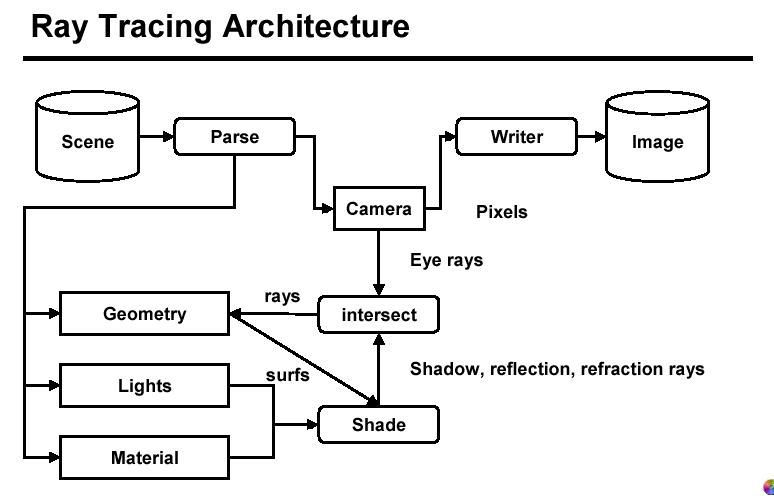

# Realismo Visual - WIP

<!--
Já foi começado antes, o tempo abaixo vai ser só eu terminando. Na verdade não sei se já resumi ou se só converti o pdf.

Chequei. Só converti do PDF mesmo. 😮‍💨

Comecei: 15/02/23 - 
Finalizei: 15/02/23 - 
Duração: 
-->

Aluno: João Vítor Fernandes Dias
Professor: Luis Antonio Rivera Escriba

Semestre: 2022/E - 2023/01~2023/02

## Realismos Visuais

A ideia do realismo visual é conseguir reproduzir objetos virtuais de forma a se tornar indistinguível de um objeto real. O realismo se dá em duas frentes diferentes. Em uma delas, visa-se criar imagens estáticas que se assemelhem ao mundo real; outra é criar objetos e cenas em movimentos que se assemelhem, também, ao mundo real.

## Rendering

Rendering é um termo em inglês que se refere a criação cintética de imagens ou ambientes virtuais que visem através de processos computacionais gerar um produto final. Em termos de computação gráfica, esse produto final tende a ser visual, lidando com a geometria dos objetos, objetos em cena, comportamento da iluminação, reflexão dos materiais, etc.

## Fases de Processo de Realismo Visual

Para gerar o realismo visual, ocorrem algumas das seguintes fases:

- Construção do modelo
- Aparência tridimensional: Transformações, projeções, perspectivas...
- Eliminação de polígonos ou faces escondidas considerando a câmera virtual
- Recortes (Clipping) para renderizar apenas o segmento visível da cena.
- Rasterização: objeto 3D transformado em pixel
- Colorir cada pixel individualmente, levando em consideração os efeitos de luz e sombras, e as propriedades de materiais como transparência e textura

## Rasterização

A rasterização é o processo de converter vetores em matrizes de pontos. Esta transormação tende a gerar linhas com aparência serrilhada (aliasing), e para isso existem algoritmos de *anti-aliasing*.

### Rastering de retas

Uma execução frequente deste processo de rasterização envolve as retas. Mas como as resoluções dos dispositivos eletrônicos são limitadas a uma certa quantidade de pixels, é necessário que seja feita um aproximação dos pontos da reta que contém pontos matematicamente infinitos nas redondezas do local por onde passa a reta.

Para lidar com essas imperfeições trazidas pelas retas, utilizamos dos algortimos já citados. Um deles sendo o **Algoritmo de Bresenham**, onde, para cada pixel próximo de onde passa a linha limitada pelos $P1=(x_1, y_1)$ e $P2(x_2, y_2)$, rege-se o seguinte algoritmo:

```c++
  x = x1;
  y = y1;
  dx = x2 – x1;
  dy = y2 – y1;
  m = dy/dx;
  e = m – 0.5;
  for (i = 1; i<= dx; i++) {
    desenhaPonto(x, y)
    while (e >= 0){
      y = y + 1;
      e = e – 1;
    }
    x = x + 1;
    e = e + m;
  }
```

### Rastering de Polígonos por Scan Line

Além de retas, também ocorre a rasterização de polígonos. Para eles, primeiro os objetos 3D são projetados em um plano, assim determinando os segmentos de arestas que os compõem e então aplicando o raster para cada um dos segmentos.

Após esta etapa, então é analisada cada linha para definir qual é a área externa e externa para então preencher o que faltar.

## Remoção de linhas e superfícies escondidas

Considerando que wire-frames são formas rústicas de se visualizar objetos 3D, podemos considerar que, as wire-frames que não se encontrem sendo vistas diretamente, possam então ser tratadas de forma diferente. Pode-se tracejar com a mesma cor, cor diferente, ou então até mesmo não tracejar.

Alguns algoritmos populares são:

- Algoritmo do Pintor
- Algoritmo de Eliminação de faces ocultas pelo cálculo normal
- Algoritmo Algoritmo Z-Buffer

### Algoritmo do Pintor

A ideia do algoritmo é simular a forma como um pintor faria: primeiro pinta os objetos distantes. Então "Se face A bloqueia a visão de B, então B está mais distante que A".

As etapas do algoritmo seriam:

- Calcular a distância de todas as faces presentes na cena até o observador.
- Ordenar todos os polígonos por valor de distância
- Resolver redundâncias
- Desenhar os polígonos do mais distante ao menos distante

Os problemas desse algoritmo ocorrem quando temos objetos que estão parcialmente visíveis, por exemplo duas mãos com dedos entrelaçados. Ao mesmo tempo que uma mão está oculta pela outra, ela ainda assim tem partes de si que estão à frente da outra.

### Algoritmo de elimação de faces ocultas pelo cálculo normal

Neste algoritmo, as etapas seriam:

- Ler as coordenadas dos objetos através de um ponto de referência
- Armazenar esses dadods em forma de matriz
- Localizar a posição do observador
- Calcular o vetor normal de cada face do objeto
- Calcular o vetor da linha de visibilidade para cada face do objeto
- Realizar a verificação de visibilidade
  - Se maior que 0, a face estará visível
  - Se menor que 0, a face estará invisível
- Definir os cantos do objeto e armazená-los  de forma matricial
- Verificar os cantos visíveis de acordo com seu posicionamento
- Tracejar arestas das faces visíveis

## Ray tracing

O ray tracing trata do cômputo do comportamento dos raios luminosos, considerando suas colisões com as superfícies. Ao buscar a realidade fotográfica, a quantidade de colisões a serem computadas tende a ser cada vez maior. Além da luz direcional advinda de alguma fonte direcional, há também a luz ambiente que é uma luz difusa que vêm de várias direções através das reflexões de objetos foscos.

### Interseção dos raios

Para calcularmos como os raios luminosos se comportam, consideramos que o raio "sai" do ponto focal onde se encontra o observador, se dirige ao objeto e após algumas reflexões, alcança por fim a fonte luminosa.

Caso hajam muitas colisões, pode-se estimar que está havendo uma obstrução do caminho, e que por isso aquele local estaria obscurecido.

### Arquitetura do raytracing

A arquitetura do Ray Tracing obtida [deste link][LinkRT].



Esta imagem indica a seguinte sequência:

- A cena computada é analisada e é "vista" pela câmera.
- A cena também é analisada quanto à sua geometria, luzes e materiais.
- As luzes e materiais geram sombras baseadas em suas geometrias.
- As sombras, são calculadas baseadas nas interseções dos raios luminosos e os raios advindos da câmera que foram refletidos pelas geometrias dos objetos.
- Por fim, estas informações são convertidas em pixels.
- Estes pixels então são usados para se escrever uma imagem.

[LinkRT]: http://www.vrarchitect.net/anu/cg/GlobalIllumination/rayTracingArchitecture.en.html

## Rendering de um frame

O rendering de um frame pode ser dado pelo seguinte algoritmo provido pelo professor da disciplina:

<details>

<summary>

**Código disponibilizado**

</summary>

```c++
  for (int j = 0; j < imageHeight; ++j) {
    for (int i = 0; i < imageWidth; ++i) {
      // compute primary ray direction
      Ray primRay;
      computePrimRay(i, j, &primRay);
      // shoot prim ray in the scene and search for intersection
      Point pHit;
      Normal nHit;
      float minDist = INFINITY;
      Object object = NULL;
      for (int k = 0; k < objects.size(); ++k) {
        if (Intersect(objects[k], primRay, &pHit, &nHit)) {
          float distance = Distance(eyePosition, pHit);
          if (distance < minDistance) {
            object = objects[k];
            minDistance = distance;
            // update min distance
          }
        }
      }
      if (object != NULL) {
        // compute illumination
        Ray shadowRay;
        shadowRay.direction = lightPosition - pHit;
        bool isShadow = false;
        for (int k = 0; k < objects.size(); ++k) {
          if (Intersect(objects[k], shadowRay)) {
            isInShadow = true;
            break;
          }
        }
      }
      if (!isInShadow) {
        pixels\[i][j] = object->color * light.brightness;
      } else {
        pixels\[i][j] = 0;
      }
    }
  }
```

</details>
