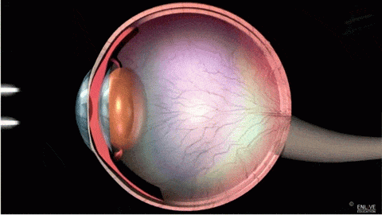
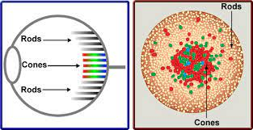
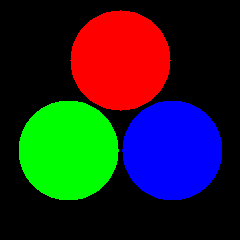

# CORES

<!--
Comecei:    15/02/23 - 13h12
Finalizei:  15/02/23 - 14h13
Duração: 1h00 (Sem imagens)
-->

Aluno: João Vítor Fernandes Dias
Professor: Luis Antonio Rivera Escriba

Semestre: 2022/E - 2023/01~2023/02

## Cores e o olho humano

Para sermos capaz de enxergarmos as cores, é necessário que a luz venha de alguma fonte e alcance os nossos olhos. Ela então alcança a retina que processa a luz como uma imagem.

### Retina e receptores de ondas

Nossa retina possui diversas células específicas para processar a luz de diversas formas chamadas fotorreceptores. As mais relevantes para a percepção luminosa são os cones e os bastonetes. O primeiro percebe os tipos de cores e o segundo lida com situações de pouca luminosidade.

#### Cores e cones

Considerando que aqui estamos querendo explicar o fenômeno das cores, deixaremos de lado os bastonentes em prol de uma explicação mais detalhada dos cones.

Temos 3 tipos de cones, cada um deles responsável por uma faixa de cores, sendo elas vermelho, verde e azul.

## Cores aditivas: RGB

Como forma de representar e quantificar as cores é utilizado o sistema RGB, sigla para as cores *Red* (Vermelho), *Green* (Verde) e *Blue* (Azul). Entre elas é possível haver misturas aditivas com o objetivo de criar novas cores.

Por exemplo: ao misturarmos vermelho e verde em igual proporção, teremos o amarelo. Se misturarmos verde e azul, obtemos o ciano. Se misturarmos vermelho, verde e azul obtemos o branco. Ao tirarmos as três, obtemos o preto, ou seja, a ausência de cores.

Isso se mostra verdadeiro no caso de misturas de cores luminosas. Ao lidarmos com a mistura de pigmentos, ao misturarmos as três cores, a cor resultante, ao invés de branco, é o preto.

## O que é a luz?

O que chamamos de luz, na verdade é um onda eletromagnética presente em uma faixa específica e limitadade de frequência que consegue ser processada pelo olho humano. A "luz branca" que tende a ser a mais usual é constituída por um conjunto de diversas frequências simultaneamente, como visto anteriormente.

## Descrição da cor de uma luz

 Ao utilizarmos um prisma transparente com um formato específico, podemos separar ela em suas componentes de origem, resultando então em um espectro luminoso colorido por apresentar diversas frequências.

## Para que servem as cores?

Cores são amplamente utilizadas no dia a dia, a ponto de se tornar algo ubíquo. Ao utilizar bem as propriedades das cores, consegue-se:

- Gerar uma boa legibilidade ao transmitir informações em anúncios
- Gerar imagens realistas
- Focar a atenção
- Passar emoções
- Gerar produtos atrativos
- Decorar objetos e ambientes
- Gerar arte

Enfim... Vemos que existem diversas aplicações, talvez limitadas apenas pela criatividade de quem reflete sobre.

## Sistema de cores aditivas e subtrativas

Como comentado anteriormente, temos o sistema de cores luminosas e as cores pigmentais que funcionam de formas diferentes. O primeiro é chamado de "Cores aditivas", o segundo, de  "Cores subtrativas".

Enquanto temos o sistema RGB para ilustrar as cores aditivas, remos o sistema CMYK que ilustra as cores subtrativas. O primeiro é utilizado em aparelhos que emitem vídeos, enquanto que o segundo é utilizado em pinturas e impressoras.

## Modelo de cor

Ao longo dos anos foram observadas diversas propriedades das cores representadas. Com isso, surgem novos modelos que tentam exemplificar a variação dessas propriedades.

Algumas das propriedades são:

- Matiz (HUE)
- Saturação
- Valor
- Tonalidade
- Luminância
- Quantidade de determinadas cores

E para isso, surgem alguns modelos como>

- HSV
- HLS
- RGB
- CMYK

## Transformações entre espaços de cor

Outra abordagem à teoria das cores são os espaços de cor. Que são modelos matemáticos para representar as variações de cores.

Para migrar de um espaço de cor ao outro, podem ser ser utilizadas transformações lineares ou não lineares.

Um exemplo dessa transformação é:

- De RGB para XYZ (linear) (NTSC RGB)

$$
\begin{bmatrix}
    X \\ Y \\ Z
\end{bmatrix} =
\begin{bmatrix}
    0.6068909 && 0.1735011 && 0.2003480 \\
    0.2989164 && 0.5865990 && 0.1144845 \\
    0.0000000 && 0.0660957 && 1.1162243 \\
\end{bmatrix}
\begin{bmatrix}
    R_{CIE} \\ G_{CIE} \\ B_{CIE} \\
\end{bmatrix}
$$

Outras matrizes de transformação podem ser vistas [neste link][LinkMatrix].

[LinkMatrix]: http://www.brucelindbloom.com/index.html?Eqn_RGB_XYZ_Matrix.html
