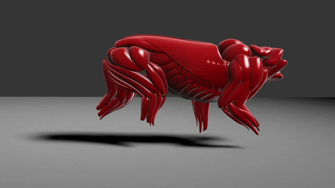

# Animação - WIP

Aluno: João Vítor Fernandes Dias
Professor: Luis Antonio Rivera Escriba

Semestre: 2022/E - 2023/01~2023/02

## Animação ou Simulação

- Animação: ocorre a variação da forma ao longo do tempo
- Simulação: tenta calcular a movimentação de objetos de acordo com um conjunto específico de regras físicas

## Animação baseada na física

Através do código, são definidas algumas regras físicas que a figura deve seguir. Tais como colisão, gravidade, velocidade do vento, atrito, etc.

## Aplicação

Tornar mais atrativo as mídias gerais, sejam elas filmes, propagandas, análises físicas da engenharia, ramos diversos da medicina, dentre outros.

Com atrativo, me refiro a tornar mais dinâmica a visualização de uma imagem de simulação de colisão entre carros e de comportamento de partículas e fluidos, ao invés de depender apenas de dados numéricos.

## Animação por computador

Animação tradicional vista em filmes antigos, dependiam de desenhos manuais que eram compilados e passados com rapidez em uma sequência de imagens que geram a impressão de movimento.

Ou então através do efeito de [stop motion][BoxTrolls].

[BoxTrolls]: https://youtu.be/3h7p0NckTKc

<!-- GIF de animação stop motion de uns caras meio trevosos que não me lembro. Boxtrolls? -->

Existe também a animação por computador. Dentre elas, é possível haver animação assistida por computador com keyframes que servem de pontos de apoio para interpolação.

Essas animações podem ser feitas em alto nível ou baixo nível. Onde no baixo nível é necessário especificar cada um dos movimentos, enquanto no alto nível, apenas é necessário descrever o movimento do ator.

## Formas de animação

As formas de animação, embora hajam diversas vertentes para realizar a simulação de movimento, elas entre si tendem a permitir ocorrer diversas das formas de simulação simultaneamente

### [KeyFrames][LinkKeyFrame]

Nas keyframes apenas alguns frames são definidos, e então, os frames que devem existir entre eles é definido e calculado por computador.

[LinkKeyFrame]: https://medium.com/uxmotiondesign/o-que-sa%CC%83o-keyframes-e-como-usa%CC%81-los-corretamente-4d108fd6aacc

### Script

Através de códigos computador é possível definir uma sequência de comandos em linguagem interpretável para que possamos controlar objetos, propriedades, texturas e comportamentos de objetos. Como por exemplo com a engine [Manim][LinkManim].

[LinkManim]: https://github.com/3b1b/manim

### Procedimental

A forma procedimental apresenta uma abordagem similar ao Script, entretanto considerando um nível mais alto da programação baseado em leis físicas.

### Representacional

Neste tipo de animação, o objeto varia sua forma. Como por exemplo cabelos, músculos, gestos, etc.

<!--  -->

### Estocástica

Usa processos aleatórios para controlar um grupo de objetos, como por exemplo diversas partículas que interagem entre si. Esse tipo de processo pode ser regulado através das cadeias de markov.

### Comportamental

Regra de comportamento para um conjunto de objetos. Geralmente associado com Inteligência Artificial. Exemplos desse tipo de simulação incluem o controle do movimento de grupos, de bandos.

## Canal Alpha

É o pixel para transparência. Varia de branco (opaco) a preto (transparente).

Com isso, o pixel passa a ter um total de 32 bits: 8 bits para cada canal, Red, Green, Blue e Alpha.

Mais informações sobre o canal alpha podem ser vistos [neste vídeo][LinkCaptain].

[LinkCaptain]: https://youtu.be/XobSAXZaKJ8

## Captura de movimento

Com a captura de movimento, foi possível converter os movimentos de um ator real em movimentos de um ator virtual. Isso se dá através da técnica da rotoscopia que de pegar um movimento como base e converter ele para um movimento "artificial" ou simulado.

### Sistemas de captura

Algoritmos de captura de movimento: ótimo, mecânico, magnético e acústicos.

- Ótico: utiliza da visão computacional para analisar refletores do corpo, ou então marcas anatômicas. É possível também utilizar do cálculo da cinemática inversa para conseguir animar um esqueleto virtual do ator.
- Mecânico: figuras articuladas conectadas ao corpo. Provavelmente utilize de um sensor de torção para analisar quanto do corpo está sendo girado e em que posição.
- Magnético: através de sensores magnéticos são analisadas as movimentações realizadas pelos atores. <!-- Não sei ao certo -->
- Acústico: marcadores acústicos precisos são colocados no corpo e calculados baseados no tempo de resposta.

## Animação de personagens 3D

Para a animação de personagens 3D, muitas vezes é utilizada uma estrutura de ossos hierarquicamente distribuída.

### Cinemática

A cinemática rege a forma de se realizar o movimento dessas animações. Pode ser dividida em dois tipos:

- **Cinemática Direta**

A cinemática direta usa as equações cinemáticas para determinar a pose, dados os ângulos das juntas.

- **Cinemática Inversa**

A cinemática inversa computa os ângulos das juntas para uma determinada pose da figura.

#### Ossos

Na animação de personagens, existem o conceito de ossos que são segmentos rígidos com uma hierarquia e que apresentam articulações.

#### Esqueleto

O esqueleto é o conjunto de ossos e articulações. Ele é controlado pela cinemática inversa.

### Animação por deformação

Como citado anteriormente, a animação por deformação tende a utilizar de corpos consideravelmente maleáveis que deformam de acordo com o movimento, como por exemplo músculos, expressões faciais, molas, etc.

## Sistema de Partículas

O sistema de particulas permite criar objetos que não possuem arestas e faces, como por exemplo neve, chuva, fogo, fumaça, nuvens, água, etc.

### Propriedades de partículas

As suas propriedades físicas são:

- Possui 3 graus de liberdade (x, y, z)
- Tem uma posição no espaço (x, y, z)
- Não tem volume
- Tem massa (m)
- Pode ter velocidade e aceleração
  - Quantidade de movimento
- Apresenta influência das forças internas e externas

### Dinâmica de partículas em animação

A força resultante define o comportamento da partícula, ela é o somatório de diversas forças diferentes como gravitacional, elástica, atrito, etc.

### Animação de Partículas

### Forças que atuam sobre a partícula

Algumas forças podem afetar a variação do movimento da partícula, como por exemplo:

- **Fricção/Atrito**

$$
 F_{fric}= N*\mu_{e}
$$

- **Elástica**

$$
    F = -k*x
$$

- **Magnética**

$$
  \vec{F} = q(\vec{v} \times \vec{B})
$$

Dentre várias outras.

### Estado de uma partícula

Uma partícula no instante $t_i$ tem:

- $X(t_i)$: posição no espaço
- $v(t_i)$: velocidade linear $(X'(t_i))$
- Estado: $S(t_i) = [X(t_i), v(t_i)]$

Assim, no instante $t_{i+1}=t_i + \Delta t$, teremos:

$$
S(t_{i+1})= [X(t_{i+1}), v(t_{i+1})] = S(t_i) + \Delta S(t_i)
$$

### Representação básica de partículas

Como estrutura dos daodos necessária para representação da partícula, precisamos definir a ela uma massa, uma posição P constituída de sua posição cartesiana em X, Y e Z, sua velocidade e qual a força que está sendo realizada sobre ela.

Essas são apenas as representações básicas. Elas na prática necessitam de outras variáveis, mas isto variará de implementação para implementação.

### Dinâmica da partícula

A cada ciclo de processamento a partícula sofrerá alteração em seu estado interno ($\Delta S(t_i)$).

- Sua posição variará baseado na velocidade anterior.
- Sua velocidade variará baseado na força que está sendo aplicada sobre si.

### Soluções numéricas

Uma das formas de lidar com esses cálculos de variação de estados é através do método de Euler.

Calcula $s(t_1)$ a partir de $s(t_0)$ e $s'(t_0)$, resultando na seguinte fórmula:

$$ s(t_1) = s(t_0) + (t_1 - t_0)s'(t_0) $$

Ela apresenta uma boa aproximação em caso de equações que contenham apenas velocidade, mas ao conter a aceleração, ela tende a se afastar do valor exato.
